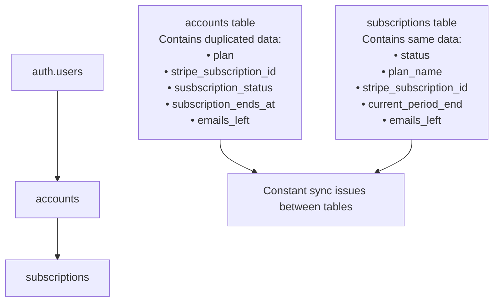
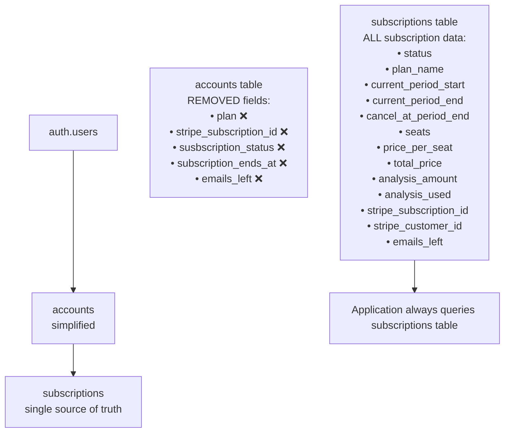

# Subscription Architecture Refactor

## Problem: Dual-Table Complexity

The original architecture had subscription data split between two tables:

### ❌ Before: Dual Table Architecture



**Issues with this approach:**

- **Data duplication** between `accounts` and `subscriptions` tables
- **Synchronization problems** when tables get out of sync
- **Complex logic** to determine which table is the "source of truth"
- **Database constraint violations** when updating inconsistent data
- **Harder to maintain** due to multiple update points

## Solution: Single Source of Truth

### ✅ After: Subscriptions-Only Architecture



## Benefits

### 1. **Eliminates Sync Issues**

- No more dual-table synchronization problems
- Database constraint violations resolved
- Single update point for all subscription changes

### 2. **Simplified Logic**

- Application always queries `subscriptions` table
- No complex logic to determine "source of truth"
- Cleaner, more predictable code

### 3. **Better Data Integrity**

- One table = one source of truth
- Consistent data at all times
- No possibility of conflicting information

### 4. **Easier Maintenance**

- Single place to update subscription data
- Simpler API endpoints
- Reduced code complexity

### 5. **Performance Improvements**

- Fewer database queries needed
- No complex joins to reconcile data
- Faster subscription status checks

## Migration Strategy

### Phase 1: Data Consolidation ✅

- [x] Add missing fields to `subscriptions` table
- [x] Migrate data from `accounts` to `subscriptions`
- [x] Mark `accounts` subscription fields as deprecated
- [x] Create helper functions and views for backward compatibility

### Phase 2: API Refactoring ✅

- [x] Update sync APIs to use only `subscriptions` table
- [x] Refactor subscription utilities
- [x] Update dashboard pages to use new logic
- [x] Fix database constraint issues

### Phase 3: Complete Migration (Future)

- [ ] Update all remaining API endpoints
- [ ] Update frontend components to use new utilities
- [ ] Remove deprecated fields from `accounts` table
- [ ] Remove backward compatibility views

## Code Changes Made

### 1. Database Migration

```sql
-- Add missing fields to subscriptions table
ALTER TABLE public.subscriptions
ADD COLUMN IF NOT EXISTS stripe_customer_id TEXT,
ADD COLUMN IF NOT EXISTS emails_left INTEGER DEFAULT 100;

-- Mark accounts fields as deprecated
COMMENT ON COLUMN public.accounts.plan IS 'DEPRECATED: Use subscriptions.plan_name instead';
```

### 2. API Refactoring

```typescript
// Before: Complex dual-table updates
await supabase.from('accounts').update({...})
await supabase.from('subscriptions').update({...})

// After: Single table update
await supabase.from('subscriptions').update({...})
```

### 3. Utility Functions

```typescript
// New simplified utility
export async function getCurrentActiveSubscription(account_id: string) {
  // Single query to subscriptions table
  return await supabase.from('subscriptions').select('*')...
}
```

## Testing

To verify the fix works:

1. **Test Manual Refresh**: Should no longer get constraint violations
2. **Test Subscription Sync**: All updates go to subscriptions table only
3. **Test Plan Changes**: Status changes reflected immediately
4. **Test Cancellations**: No more sync issues between tables

## Next Steps

1. Run the migration: `supabase migration up`
2. Test the manual refresh functionality
3. Gradually migrate remaining components to use new utilities
4. Eventually remove deprecated fields from accounts table

This refactor eliminates the root cause of the synchronization issues you were experiencing and
provides a much cleaner, more maintainable architecture.
